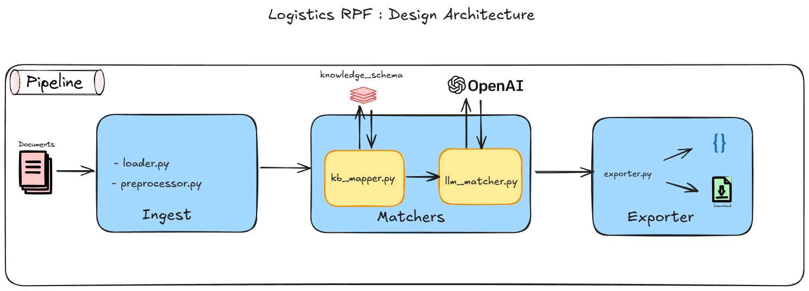

# Solution Design Document : Logistics RFP Column Normalization

**Created by:** Vikram Karthikeyan                                                      
**Date:** 23-Mar-2026


## Problem Statement

Freight forwarders receive RFP (Request for Proposal) files from shippers in highly non-standard formats. Column headers vary wildly across shippers — different naming conventions, abbreviations, combined data-and-currency columns, and embedded metadata (e.g. date formats in header names). 

Each forwarder maintains a standardized internal schema for pricing, routing, and analytics. 

The project aims to automate the process of mapping incoming RFP columns to this schema.

## Goal:

 Build a Python system that automatically maps arbitrary RFP column headers to a fixed internal target schema, with confidence scores, minimal manual intervention, and the ability to generalize to previously unseen formats.

## Assumptions:

 - The input files are in CSV format.
 - The input files will always have a header row.
 - The currency used is one of the following: "USD", "EUR", "GBP", "JPY", "CNY", "AUD", "CAD", "CHF", "HKD", "SGD"
 - Any Ambiguity in the container types will be resolved using the knowledge base and the LLM.
 - The knowledge base is generated using domain specific knowledge from online resources and consolidated through an LLM.
 - The only possible type of combined columns would be a combination of any column + the currency field.

 ## Target Schema

The internal schema consists of seven fields:

| Field | Description |
|---|---|
| `origin_port` | Port of loading / departure |
| `destination_port` | Port of discharge / delivery |
| `container_type_20gp_rate` | Rate for a 20-foot general purpose container |
| `container_type_40hq_rate` | Rate for a 40-foot high-cube container |
| `estimated_time_of_departure` | Scheduled sailing / departure date |
| `transit_time_days` | Number of days in transit |
| `currency` | Currency code for the quoted rates |

---

## Approach:

The System uses a cost optimized approach to map the columns to the target schema by performing localized matching using a domain specific knowledge base and fuzzy matching  to calculate similarity scores and only using LLMs for columns that fall below the set confidence threshold. This minimizes API cost and latency while maintaining high accuracy on edge cases.

The pipeline consist of the following steps:

### 1. Preprocessing

Raw input file column names are normalized before any matching occurs.Perform data and header cleaning to handle **Ambiguity issues** (e.g. combined container type and currency in one column, ambiguous container types). 

### 2. Matching Input Columns to Target Schema

Mapping is performed using a two-step approach:

#### Knowledge Base + Fuzzy Matching: 

A curated **synonym dictionary** maps each target schema field to known synonyms drawn from real-world RFP conventions. The synonym dictionarywaas generated by gathering domain specific knowledge from online resources and consolidated through an LLM.

Websites parsed to gather the required info include:
- freightpaul.com
- quotiss.com
- www.hapag-lloyd.com
- www.cogoport.com
- www.easypost.com
- www.xeneta.com
- portcitylogistics.com

This is done to improve the accuracy of the mapping and to reduce the number of LLM calls required.

#### LLM Mapping (API call, GPT-4o): 

Only columns that fall below the set confidence threshold in the previous step are sent to the LLM for mapping.

It uses a tailored prompt with the target schema, scoring guidelines and few-shot examples to map the column to the target schema. The output format is also specified so that the LLM output can be consolidated with the previous steps output.

### 3. Output Generation

- Return a JSON log file with the mapped column headers and their confidence scores.
- Return processed files with the standardized column headers.  

## System Architecture




### Module Responsibilities

| Module | Path | Role |
|---|---|---|
| **Config** | `src/config/config.py` | Environment variables, model names, file paths |
| **Schema** | `src/config/schema.py` | Target schema fields, knowledge base synonyms, currency codes |
| **DataLoader** | `src/ingest/loader.py` | Read CSV/Excel into pandas DataFrame |
| **Preprocessor** | `src/ingest/preprocessor.py` | Header normalization and combined-column resolution |
| **KnowledgeBaseMatcher** | `src/matchers/kb_mapper.py` | fuzzy matching against synonym dictionary |
| **LLMMatcher** | `src/matchers/llm_matcher.py` | GPT-4o fallback for ambiguous columns |
| **Validator** | `src/matchers/validator.py` | (Placeholder — not yet implemented) |
| **MappingExporter** | `src/exporter/exporter.py` | Write JSON mapping log with summary statistics |
| **ColumnMapper** | `src/exporter/exporter.py` | Rename DataFrame columns and write updated CSV |
| **Pipeline** | `src/pipeline/pipeline.py` | Single-file orchestrator |
| **BatchPipeline** | `src/pipeline/batch_pipeline.py` | CLI batch runner for all files in a directory |

### Data Flow (Single File)

```
1. Pipeline.__init__(file_name)
   └─ DataLoader reads CSV → DataFrame
   └─ Preprocessor initialized with raw DataFrame

2. Pipeline.ingest()
   └─ Preprocessor.resolve_combined_columns(df)  → strip embedded currencies from cell values
   └─ Preprocessor.preprocess_header(columns)     → normalize column names
   └─ Return cleaned DataFrame

3. Pipeline.key_mapping(df)
   └─ For each column: KnowledgeBaseMatcher.match(col)
   └─ Return {col_name: {schema_field, confidence, source:"kb", status}}

4. Pipeline.llm_mapping(kb_mapping)
   └─ Filter columns where status == "Verify"
   └─ If none → return kb_mapping unchanged (no API call)
   └─ LLMMatcher sends batch prompt to GPT-4o
   └─ Parse JSON response → merge into mapping
   └─ Return final {col_name: {schema_field, confidence, source, status, reasoning?}}

5. Pipeline.export_mapping(mapping)
   └─ MappingExporter writes JSON with summary stats

6. Pipeline.apply_mapping(df, mapping)
   └─ ColumnMapper renames matched columns → writes updated CSV
```

### Confidence Scoring
 - For the kb mapper, the confidence score is currently set to 100, if the input column is an exact match to the synonym in the knowledge base, otherwise it is set to 'Verify' and will be handled by the llm mapper.
 - For the llm mapper, the confidence score is calculated as per the below guidelines:
    - 80-100: Direct match or very strong semantic similarity
    - 60-79: Good match with some ambiguity
    - 40-59: Possible match, requires context
    - Below 40: Unlikely match, flag for manual review

## 5. Output Format

### Mapping JSON

Example:

```json
{
    "summary": {
        "total": 7,
        "matched": 7,
        "verify": 0,
        "kb_resolved": 5,
        "llm_resolved": 2
    },
    "mappings": {
        "place of receipt": {
            "schema_field": "origin_port",
            "input_field": "place of receipt",
            "confidence": 100,
            "source": "kb",
            "status": "Match"
        },
        "sailing days": {
            "schema_field": "transit_time_days",
            "input_field": "sailing days",
            "confidence": 85,
            "source": "llm",
            "status": "Match",
            "reasoning": "The term 'sailing days' closely aligns with transit time..."
        }
    }
}
```

- **confidence**: 0–100 integer score
- **source**: `"kb"` (local fuzzy match) or `"llm"` (GPT-4o)
- **status**: `"Match"` (confident mapping) or `"Verify"` (needs human review)
- **reasoning**: Present only for LLM-resolved mappings; explains the domain logic

### Updated CSV

The output CSV has matched columns renamed to schema field names. Unmatched columns are preserved with their original (preprocessed) names and a warning is printed.

#### Sample files:

##### Input File:
```csv
Origin,Dest Port,20GP Rate,40HC Rate,Sailing Date,T/T,Curr
Shanghai,Rotterdam,1200 USD,2200 USD,2024-03-15,28,USD
Ningbo,Hamburg,1300 USD,2400 USD,2024-03-18,32,USD
Shenzhen,Antwerp,1250 EUR,2300 EUR,2024-03-20,30,EUR
Qingdao,Felixstowe,1150 GBP,2100 GBP,2024-03-22,35,GBP
```

##### Output File:

`mapping.json`
```json
{
    "summary": {
        "total": 7,
        "matched": 7,
        "verify": 0,
        "kb_resolved": 3,
        "llm_resolved": 4
    },
    "mappings": {
        "origin": {
            "schema_field": "origin_port",
            "input_field": "origin",
            "confidence": 95,
            "source": "llm",
            "status": "Match",
            "reasoning": "The input field 'origin' is a direct reference to the starting point of the shipment, which aligns with the 'origin_port' field in the target schema."
        },
        "dest port": {
            "schema_field": "destination_port",
            "input_field": "dest port",
            "confidence": 95,
            "source": "llm",
            "status": "Match",
            "reasoning": "The input field 'dest port' explicitly indicates the endpoint of the shipment, making it a direct match for the 'destination_port' in the target schema."
        },
        "20gp rate": {
            "schema_field": "container_type_20gp_rate",
            "input_field": "20gp rate",
            "confidence": 100,
            "source": "kb",
            "status": "Match"
        },
        "40hc rate": {
            "schema_field": "container_type_40hq_rate",
            "input_field": "40hc rate",
            "confidence": 88,
            "source": "llm",
            "status": "Match",
            "reasoning": "The input field '40hc rate' likely refers to the shipping rate for a high-cube 40-foot container, which matches the 'container_type_40hq_rate' field in the target schema, as 40hc is commonly used interchangeably with 40HQ."
        },
        "sailing date": {
            "schema_field": "estimated_time_of_departure",
            "input_field": "sailing date",
            "confidence": 100,
            "source": "kb",
            "status": "Match"
        },
        "t/t": {
            "schema_field": "transit_time_days",
            "input_field": "t/t",
            "confidence": 85,
            "source": "llm",
            "status": "Match",
            "reasoning": "The input field 't/t' appears to be an abbreviation for 'transit time,' which aligns closely with 'transit_time_days,' representing the number of days taken for the shipment transit."
        },
        "curr": {
            "schema_field": "currency",
            "input_field": "curr",
            "confidence": 100,
            "source": "kb",
            "status": "Match"
        }
    }
}
```

`updated.csv`
```csv
origin_port,destination_port,container_type_20gp_rate,container_type_40hq_rate,estimated_time_of_departure,transit_time_days,currency
Shanghai,Rotterdam,1200 USD,2200 USD,2024-03-15,28,USD
Ningbo,Hamburg,1300 USD,2400 USD,2024-03-18,32,USD
Shenzhen,Antwerp,1250 EUR,2300 EUR,2024-03-20,30,EUR
Qingdao,Felixstowe,1150 GBP,2100 GBP,2024-03-22,35,GBP
```

### Execution :

Single File Processing Pipeline:

Manually edit the file name in the `src\pipeline\pipeline.py` file.

```cmd
python -m src.pipeline.pipeline
```

Batch Processing Pipeline:

The Batch pipelins will process all the file present in the `data\input` directory and store it in the `data\output` directory.

```cmd
python -m src.pipeline.batch_pipeline data\input
```
